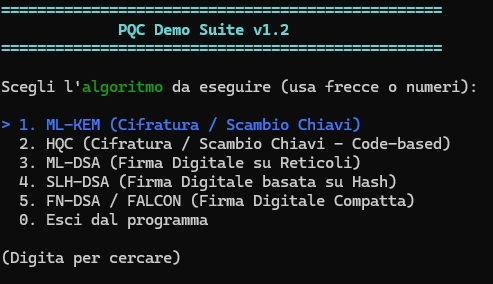
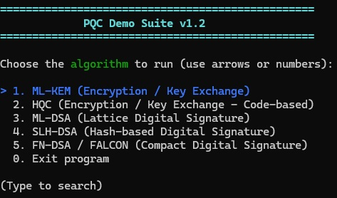

# 🛡️ PQC Demo Suite v1.2

An interactive CLI application implementing the official NIST Post-Quantum Cryptography (PQC) standards via BouncyCastle and Spectre.Console.

[English](#english) • [Italiano](#italiano)

---

### 📸 Screenshots

| 🇮🇹 Interfaccia Italiana | 🇬🇧 English Interface |
| :---: | :---: |
|  |  |

---

## 🇬🇧 English

### Overview
**PQC Demo Suite v1.2** is a .NET console tool designed to demonstrate the key generation, encapsulation, signing, and verification workflows of the NIST Post-Quantum Cryptography standards.

### Supported Algorithms & Standards
* **ML-KEM (FIPS 203):** Module-Lattice-Based Key-Encapsulation Mechanism (ML-KEM-512, ML-KEM-768, ML-KEM-1024).
* **HQC (FIPS 203):** Code-Based Key-Encapsulation Mechanism leveraging Hamming Quasi-Cyclic error-correcting codes (HQC-128, HQC-192, HQC-256) acting as a non-lattice encryption backup.
* **ML-DSA (FIPS 204):** Module-Lattice-Based Digital Signature Algorithm (ML-DSA-44, ML-DSA-65, ML-DSA-87).
* **SLH-DSA (FIPS 205):** Stateless Hash-Based Digital Signature Algorithm (SHA-2 / SHAKE with Small and Fast parameter sets).
* **FN-DSA / FALCON (FIPS 206):** Fast-Fourier Lattice-Based Digital Signature Algorithm (FN-DSA-512, FN-DSA-1024) supporting both **Padded** (fixed deterministic length) and **Unpadded** modes.

### Key Features
* **Bilingual Support:** Real-time localization for English and Italian.
* **Interactive CLI:** Keyboard navigation (Arrow keys + Enter) and quick numeric filtering via *Spectre.Console*.
* **Cryptographic Telemetry:** Detailed byte-level inspection of public/private keys, shared secrets, ciphertexts, and signatures.

### Prerequisites
* Windows OS
* [.NET Framework 4.8.1 Runtime / SDK](https://dotnet.microsoft.com/)
* NuGet Dependencies:
  * `BouncyCastle.Cryptography`
  * `Spectre.Console`

---

## 🇮🇹 Italiano

### Panoramica
**PQC Demo Suite v1.2** è un'applicazione console .NET sviluppata per esplorare e verificare i flussi di scambio chiavi, firma digitale e incapsulamento previsti dai nuovi standard crittografici Post-Quantistici (PQC) del NIST.

### Algoritmi e Standard Implementati
* **ML-KEM (FIPS 203):** Incapsulamento e scambio chiavi su reticoli (ML-KEM-512, ML-KEM-768, ML-KEM-1024).
* **HQC (FIPS 203):** Meccanismo di incapsulamento chiavi basato su codici a correzione d'errore quasi-ciclici di Hamming (HQC-128, HQC-192, HQC-256), utilizzato come alternativa strategica ai reticoli.
* **ML-DSA (FIPS 204):** Firme digitali ad uso generale su reticoli algebrici (ML-DSA-44, ML-DSA-65, ML-DSA-87).
* **SLH-DSA (FIPS 205):** Firme digitali stateless su funzioni di hash (SHA-2 e SHAKE con strategie Small e Fast).
* **FN-DSA / FALCON (FIPS 206):** Firme compatte su reticoli NTRU (FN-DSA-512, FN-DSA-1024) con supporto a formati **Padded** (dimensione fissa) e **Unpadded** (dimensione compressa).

### Funzionalità
* **Interfaccia Bilingue:** Selezione immediata tra Italiano e Inglese.
* **Menu Interattivi:** Navigazione fluida con frecce direzionali o selezione numerica rapida (*Spectre.Console*).
* **Ispezione Crittografica:** Visualizzazione delle dimensioni in byte, codifica Base64 e test di verifica automatica dell'integrità.

### Requisiti di Sistema
* Sistema operativo Windows
* [.NET Framework 4.8.1 Runtime / SDK](https://dotnet.microsoft.com/)
* Pacchetti NuGet richiesti:
  * `BouncyCastle.Cryptography`
  * `Spectre.Console`

---

## 📄 License
This project is licensed under the MIT License - see the [LICENSE](LICENSE) file for details.
